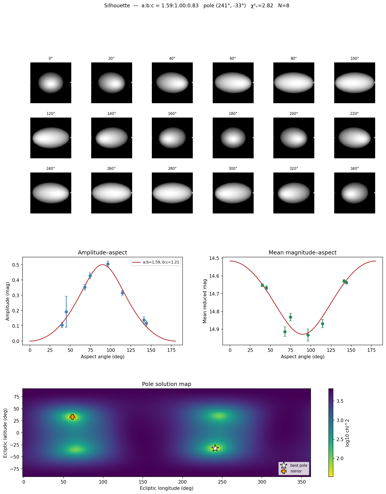

# Silhouette — Analytical Asteroid Shape & Pole Fitter

**Silhouette** takes tabular asteroid light-curve photometry and analytically
fits the triaxial axis ratios **a:b** and **b:c** together with the rotation
**pole** ecliptic longitude and latitude. It is, in effect, the *inverse* of
[SpotLight](https://github.com/SarahSonnett/SpotLight): where SpotLight renders a synthetic light curve from a
known ellipsoid and viewing geometry, Silhouette recovers the ellipsoid and pole
from observed brightness variations — and renders the result in a multi-panel
figure modelled on SpotLight's combined output.

The fit is **analytical**: it uses closed-form ellipsoid relations
(amplitude–aspect and the mean-magnitude/projected-area method) and a light
nonlinear least-squares solve — no convex inversion or shape facets.



---

## How it works

For a triaxial ellipsoid (`a ≥ b ≥ c`, spinning about `c`) observed at **aspect
angle** `θ` (the angle between the line of sight and the spin axis):

- **Amplitude:**
  `A(θ) = 2.5·log₁₀(a/b) − 1.25·log₁₀[(a²cos²θ + c²sin²θ)/(b²cos²θ + c²sin²θ)]`
- **Aspect from a candidate pole:**
  `cos θ = sin β·sin βₚ + cos β·cos βₚ·cos(λ − λₚ)`
- **Mean magnitude:** from the rotation-averaged projected area, which brightens
  toward pole-on (the full `a·b` face) and fades toward equator-on. Its variation
  between apparitions breaks the `b/c` + pole degeneracy that amplitude alone
  cannot.

Silhouette groups the photometry into apparitions, reduces each to an amplitude
and a mean reduced magnitude, then fits `(a/b, b/c, λₚ, βₚ)` jointly by weighted
least squares over a grid of pole starting points.

### What is and isn't recoverable

| Apparitions | Result |
|-------------|--------|
| **≥ 4**, spread in ecliptic longitude | Full `a:b`, `b:c`, and pole `(λ, β)` |
| **2–3** | Fit attempted, flagged as weakly constrained |
| **1** | `a/b` **lower bound** only (equatorial aspect assumed); pole and `b/c` undetermined |

The amplitude and mean-magnitude observables depend only on `sin²θ`/`cos²θ`, so
the prograde/retrograde **mirror pole** `(λₚ+180°, −βₚ)` is exactly degenerate
and is always reported alongside the best solution. Breaking it requires
epoch/timing information, which Silhouette does not currently use.

---

## Reuse of sibling repositories

Silhouette imports two of its siblings when they are on the path, and falls back
to a vendored minimal copy otherwise (so it always runs standalone):

- **[SpotLight](https://github.com/SarahSonnett/SpotLight)** — the forward triaxial renderer, used to draw the
  best-fit ellipsoid mosaic.
- **[SpinDoc](https://github.com/SarahSonnett/SpinDoc)** — the Fourier light-curve model (`fourier`) and IAU
  H–G phase function (`HGfunction`), used during per-apparition reduction.

Check `silhouette.HAVE_SPOTLIGHT` / `silhouette.HAVE_SPINDOC` to see what was
found.

---

## Installation

```bash
git clone git@github.com:SarahSonnett/Silhouette.git
cd Silhouette
pip install -r requirements.txt
```

`astroquery` is optional — it is needed only when geometry is fetched from JPL
Horizons rather than supplied in the input file.

---

## Input format

A whitespace- or comma-delimited table with a one-line header. Column names are
auto-recognised from a broad alias set; required canonical fields are
`time` (MJD or JD), `mag`, `merr`, `rhelio`, `delta`, `alpha`. Optional
`ecl_lon`/`ecl_lat` (observer-centric ecliptic coordinates of the target)
make the file fully self-contained; otherwise Silhouette fetches them from
Horizons. The SpinDoc-style calibrated photometry file
(`Frame Rhelio Delta alpha … MJD TmagCorr … TmagFinalErr`) is read directly.

```
MJD        mag      merr   Rhelio  Delta   alpha  ecl_lon  ecl_lat
58000.123  18.421   0.020  2.71    1.78    6.3    34.21    -1.05
...
```

---

## Quick start

```python
from silhouette import (read_photometry, reduce_apparitions,
                        resolve_geometry, fit_shape, save_summary)

phot = read_photometry("photometry.txt", object_name="433")
apps = reduce_apparitions(phot, period=0.2194)     # rotation period in days
resolve_geometry(apps, target="433")               # file columns, else Horizons
fit  = fit_shape(apps)

print(fit.summary())
save_summary(fit, "docs/images/fit_summary.png")
```

### Command line

```bash
python fit_shape.py --infile photometry.txt --period 0.2194 \
    --object 433 --outdir results
```

Writes `results/BestFitParameters.txt` and `results/fit_summary.png`.

### Self-checking demo

```bash
python example.py
```

Synthesises a multi-apparition data set for a *known* ellipsoid and pole
(`a:b=1.6, b:c=1.3, pole=(60°, 35°)`), then recovers them — producing the figure
above.

---

## Output figure

The summary figure mirrors SpotLight's combined layout:

1. **Ellipsoid mosaic** — the best-fit shape rendered through one rotation (via
   SpotLight when available).
2. **Amplitude–aspect** — observed amplitudes with the analytical model curve.
3. **Mean magnitude–aspect** — the projected-area brightness variation and fit.
4. **Pole solution map** — χ² over the ecliptic sky, with the best pole and its
   degenerate mirror marked.

---

## Caveats

- The amplitude–aspect method assumes **geometric scattering** (brightness ∝
  projected area). Real surfaces (and non-geometric scattering laws such as
  SpotLight's default Lambertian) introduce amplitude/aspect deviations; treat
  recovered axis ratios as model-dependent.
- Robust pole determination needs several apparitions well spread in ecliptic
  longitude; sparse coverage yields non-unique solutions — inspect the candidate
  poles and the pole map.

---

## Testing

```bash
python -m pytest tests/
```

---

*Author: S. Sonnett. Part of an asteroid photometry toolset alongside SpotLight,
SpinDoc, and WISETrails.*
