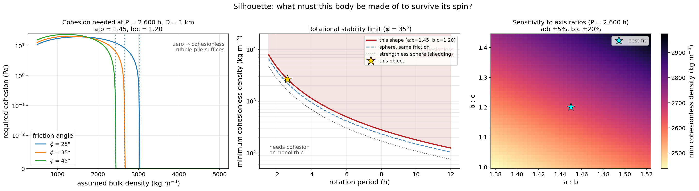

# Silhouette — Asteroid Shape, Pole, and Material Constraints from Light Curves

**Silhouette** turns tabular asteroid light-curve photometry into a shape and
spin solution, and then asks the geophysical question that shape and spin
together can answer: **what must this body be made of to survive its own
rotation?**

It offers two shape methods and a materials module:

| Stage | Method | Output |
|-------|--------|--------|
| **Fast estimate** | closed-form amplitude–aspect + mean-magnitude relations | `a:b`, `b:c`, pole `(λ, β)` |
| **Full inversion** | convex light-curve inversion (Gaussian image + SH) | convex shape → DEEVE `a:b`, `b:c`, pole, period |
| **Materials** | Drucker–Prager rotational stability | minimum bulk density, required cohesion |

It is, in effect, the *inverse* of
[SpotLight](https://github.com/SarahSonnett/SpotLight): where SpotLight renders a
synthetic light curve from a known ellipsoid and viewing geometry, Silhouette
recovers the body from observed brightness variations.


*Above: the fast analytical method applied to 109 real DAMIT light curves of
**(15) Eunomia**. From the amplitude–aspect relation alone it recovers an
elongated, retrograde spin (a:b≈1.7, b:c≈1.2, β≈−74°), ~28° from the DAMIT
convex-inversion pole (red ✕). The full convex inversion does considerably
better — see [worked examples](#worked-examples).*

---

## 1. Fast method — analytical amplitude–aspect

For a triaxial ellipsoid (`a ≥ b ≥ c`, spinning about `c`) at **aspect angle**
`θ` (between the line of sight and the spin axis):

- **Amplitude:**
  `A(θ) = 2.5·log₁₀(a/b) − 1.25·log₁₀[(a²cos²θ + c²sin²θ)/(b²cos²θ + c²sin²θ)]`
- **Aspect from a candidate pole:**
  `cos θ = sin β·sin βₚ + cos β·cos βₚ·cos(λ − λₚ)`
- **Mean magnitude:** from the rotation-averaged projected area, which brightens
  toward pole-on (the full `a·b` face) and fades toward equator-on. Its variation
  between apparitions helps break the `b/c` + pole degeneracy.

These relations and their simultaneous solution follow Michałowski (1993)
[[1]](#references), building on the amplitude–magnitude method of
Zappalà & Knežević (1984) [[2]](#references), the methodology reviewed in
Magnusson et al. (1989) [[3]](#references), and the IAU H–G phase function of
Bowell et al. (1989) [[4]](#references).

This method uses only **one amplitude per apparition**, so it is fast and robust
but cannot see shape detail beyond an ellipsoid.

### What is and isn't recoverable

| Apparitions | Result |
|-------------|--------|
| **≥ 4**, spread in ecliptic longitude | Full `a:b`, `b:c`, and pole `(λ, β)` |
| **2–3** | Fit attempted, flagged as weakly constrained |
| **1** | `a/b` **lower bound** only; pole and `b/c` undetermined |

Amplitude and mean magnitude depend only on `sin²θ`/`cos²θ`, so the
prograde/retrograde **mirror pole** `(λₚ+180°, −βₚ)` is exactly degenerate and is
always reported alongside the best solution.

---

## 2. Full method — convex light-curve inversion

Uses every photometric point rather than one amplitude per apparition, so
departures from a perfect ellipsoid are absorbed by real shape freedom. Follows
Kaasalainen & Torppa (2001) [[5]](#references) and Kaasalainen, Torppa &
Muinonen (2001) [[6]](#references).

**Representation.** The convex body is stored as its **Gaussian image**: an area
weight `aᵢ` for each surface-normal direction `nᵢ`, expanded as

```
aᵢ = exp( Σ_k c_k Y_k(nᵢ) ) · dωᵢ
```

The exponential keeps every weight positive for any real coefficients, which is
what removes the ill-posedness of the inverse problem. A valid closed body also
requires `Σ aᵢ nᵢ = 0`, enforced by a penalty.

**Forward model.** For a *convex* body a facet is visible iff `n·Ê > 0` and
illuminated iff `n·Ŝ > 0` — convexity guarantees it, so **no ray tracing or
z-buffer is needed**:

```
L = Σᵢ aᵢ · S(μ0ᵢ, μᵢ, α)      over facets with μᵢ > 0 and μ0ᵢ > 0
```

with `μ = n·Ê`, `μ0 = n·Ŝ` in the body frame. Scattering is pluggable; the
default is Lommel–Seeliger + Lambert, `S = μμ0/(μ+μ0) + c·μμ0`.

**Recovering the polyhedron.** Going from the Gaussian image to an actual shape
is the **Minkowski problem**, solved here as a convex program: minimise the
linear `Σ aᵢ hᵢ` subject to `V(h)^(1/3) ≥ 1`, which is a convex constraint by the
Brunn–Minkowski inequality, using the exact gradient `∂V/∂hᵢ = Aᵢ`. The solution
is unique only up to translation, so the body is recentred on its centre of mass
before the inertia tensor is taken.

**Shape → axis ratios.** The polyhedron's volume and inertia tensor give the
**DEEVE** (dynamically-equivalent equal-volume ellipsoid), whose `a:b` and `b:c`
feed the materials module.

**Multi-modality is real.** Convex inversion has many local minima, including a
spurious near-spherical solution that matches mean brightness but no rotational
structure. Always use `invert_convex_multistart`, which scans a grid of starting
poles and reports **distinct pole families** — several are often statistically
indistinguishable, and quoting only the lowest-χ² one overstates precision.

**Period** is an input to the shape fit; `scan_period` scans it (see
[Phase 1b](#period-scanning)).

---

## 3. Materials — density and strength from shape + spin

Given a shape and spin period, treat the body as a homogeneous, self-gravitating
triaxial ellipsoid of a Drucker–Prager (cohesive Mohr–Coulomb) material, after
Holsapple (2001, 2004, 2007) [[7]](#references)[[8]](#references)[[9]](#references).

**Ellipsoid shape integrals** (dimensionless, `A₁ + A₂ + A₃ = 2`):

```
Aᵢ = a·b·c ∫₀^∞ du / [ (aᵢ² + u) · √((a²+u)(b²+u)(c²+u)) ]
```

**Volume-averaged stresses** for uniform rotation `ω` about the short axis
(compression negative):

```
⟨σ_xx⟩ = −(1/5)·ρ·a²·(2πGρA₁ − ω²)
⟨σ_yy⟩ = −(1/5)·ρ·b²·(2πGρA₂ − ω²)
⟨σ_zz⟩ = −(1/5)·ρ·c²·(2πGρA₃)
```

(For a non-rotating sphere these reduce to `−(4π/15)Gρ²R²`, the mean pressure —
which the tests check to 1 part in 10⁸.)

**Drucker–Prager criterion.** With `I₁` the first stress invariant and `J₂` the
second deviatoric invariant, the body is stable while

```
√J₂  ≤  k − s·I₁ ,
      s = 2 sinφ / [√3 (3 − sinφ)] ,
      k = 6 Y cosφ / [√3 (3 − sinφ)]
```

for friction angle `φ` and cohesion `Y` (matched to Mohr–Coulomb at the
compressive meridian).

### Two regimes, deliberately separated

- **Minimum cohesionless density is size-independent.** Every stress term scales
  as `a²`, so the zero-cohesion condition depends only on shape, friction angle,
  and the dimensionless spin `ω²/(Gρ)`. This gives a **minimum bulk density for a
  strengthless rubble pile from the light curve alone** — no diameter required.
  If that density exceeds anything plausible for the taxonomic type, the body
  *must* have cohesion or be monolithic.
- **Cohesion in pascals needs a size**, since stress scales as `ρ²GR²`. Supply a
  diameter (e.g. from WISE/NEATM).

For context, `shedding_limit_density` gives the classic strengthless-sphere
barrier `ρ = 3π/(GP²)` (≈2.3 h at 2000 kg m⁻³; Harris 1996 [[10]](#references),
Pravec & Harris 2000 [[11]](#references)). Cohesion magnitudes are comparable to
those inferred for real fast rotators (Scheeres et al. 2010 [[12]](#references);
Sánchez & Scheeres 2014 [[13]](#references); Rozitis et al. 2014
[[14]](#references)).



*Three views of the same physics for a 1 km body at P = 2.6 h: cohesion needed
vs assumed density (left), the stability boundary in the period–density plane
(centre), and how the answer moves across the axis-ratio uncertainty box
(right). Note the right panel's gradient is mostly **vertical** — `b/c`
uncertainty dominates.*

```python
from silhouette.geophysics import min_density_cohesionless, required_cohesion

min_density_cohesionless(ab=1.45, bc=1.20, period_h=2.6)        # kg/m^3, no size needed
required_cohesion(1.45, 1.20, period_h=2.6, rho=2000,
                  diameter_km=1.0, friction_deg=35)              # Pa
```

---

## 4. How well does it work?


`study_resolution_precision.py` maps shape accuracy against **rotational
sampling** and **photometric precision**, using synthetic data with known truth,
6 apparitions, and a 25-pole multistart per cell so the statistics reflect the
data rather than optimiser luck.

**The two are coupled** — iso-accuracy contours run diagonally. For `|a/b|`
error ≲ 3%:

| points per rotation | max tolerable σ |
|---|---|
| 6 | 0.2% |
| 10 | 1% |
| 15 | 2% |
| 25 | 5% |
| 40–60 | 2% (≈4% error at σ=5%) |

Full tables and method in [docs/resolution_precision.md](docs/resolution_precision.md).

Each doubling of sampling buys roughly a factor 2 in tolerable photometric
error — **but it saturates**: beyond ~25–40 points per rotation, extra sampling
gains little and σ becomes the wall. That is expected, since a double-peaked
light curve is a low-order Fourier signal: once its harmonics are sampled, only
noise limits you.

Three caveats that matter more than the headline:

- **Sub-1% photometry is rarely achievable in practice**, so the realistic
  operating regime is the σ ≥ 1% half of that grid.
- **`b/c` is systematically the worst-determined parameter** — typically 3–15%
  error versus <1% for `a/b`. The `c` axis is constrained only through aspect
  diversity across apparitions.
- **At σ ≥ 5% there is a regime change, not gradual decay**: catastrophic pole
  failures (60–70°) appear as the optimiser stops finding the true basin.

### Shape accuracy versus pole error

Holding the pole fixed at a known offset from the truth (6 apparitions,
30 points/rotation, σ = 1.5%):

| pole error | χ²ᵥ | `a/b` error | `b/c` error |
|---|---|---|---|
| 0° | 0.88 | 2.2% | 20.8% |
| 5° | 1.04 | 2.2% | 3.1% |
| 10° | 1.30 | 15.7% | 20.2% |
| 20° | 2.38 | 21.8% | 26.4% |
| 60° | 8.91 | 26.7% | 28.3% |

Three conclusions:

1. **χ²ᵥ is a reliable alarm** — it rises monotonically with pole error, so a
   badly wrong pole is detectable.
2. **`a/b` needs the pole to ≲5–10°.**
3. **`b/c` is ~20% uncertain even with a perfect pole.** This is why
   `propagate_axis_uncertainty` defaults to ±5% on `a/b` and **±20% on `b/c`**,
   and why density/strength results should always be quoted as intervals.

---

## Reuse of sibling repositories

Silhouette imports two siblings when available, falling back to vendored copies
so it always runs standalone:

- **[SpotLight](https://github.com/SarahSonnett/SpotLight)** — forward triaxial
  renderer, used for the ellipsoid mosaics.
- **[SpinDoc](https://github.com/SarahSonnett/SpinDoc)** — Fourier light-curve
  model and IAU H–G phase function, used in per-apparition reduction.

Check `silhouette.HAVE_SPOTLIGHT` / `silhouette.HAVE_SPINDOC`.

> **Scattering convention.** Silhouette sums over *facets* of true area `aᵢ`, so
> its kernels include the μ projection factor; SpotLight renders *per pixel*,
> where projection is already in the grid. Same `f(mu0, mu, alpha, arg)`
> signature, but Silhouette's `lambert` = `μμ0` vs SpotLight's `lambertian` =
> `μ0`. Convert deliberately when porting a law between them.

---

## Installation

```bash
git clone git@github.com:SarahSonnett/Silhouette.git
cd Silhouette
pip install -r requirements.txt
```

`astroquery` is optional — needed only when fetching geometry from JPL Horizons.

---

## Input format

A whitespace- or comma-delimited table with a one-line header. Column names are
auto-recognised from a broad alias set; required fields are `time` (MJD or JD),
`mag`, `merr`, `rhelio`, `delta`, `alpha`. Optional `ecl_lon`/`ecl_lat` make the
file self-contained; otherwise geometry comes from Horizons.

```
MJD        mag      merr   Rhelio  Delta   alpha  ecl_lon  ecl_lat
58000.123  18.421   0.020  2.71    1.78    6.3    34.21    -1.05
```

**DAMIT light curves** are read natively (`read_damit_lcs` /
`damit_apparitions`); those files embed the asteroid-centric Sun/Earth ecliptic
vectors, so no ephemeris lookup is needed.

> **Uncertainties on DAMIT data.** DAMIT ships no per-point errors, and deriving
> them from point-to-point scatter is actively harmful: many archival curves were
> digitised or smoothed from published figures, so consecutive points are nearly
> identical and a scatter-based estimator collapses toward zero (we measured
> fractional σ ~10⁻⁴, after which those curves carried 96% of total χ²). Use a
> uniform fractional σ instead, and check that conclusions are insensitive to it.

---

## Quick start

```python
from silhouette import (read_photometry, reduce_apparitions,
                        resolve_geometry, fit_shape, save_summary)

phot = read_photometry("photometry.txt", object_name="433")
apps = reduce_apparitions(phot, period=0.2194)     # rotation period in days
resolve_geometry(apps, target="433")               # file columns, else Horizons
fit  = fit_shape(apps)
print(fit.summary())
save_summary(fit, "fit_summary.png")
```

### Convex inversion

```python
from silhouette import LightCurveObs, invert_convex_multistart, cluster_pole_families

fit = invert_convex_multistart(lightcurves, period=0.2534, n_workers=8, lmax=4)
print(fit.summary(), fit.axis_ratios())
for fam in cluster_pole_families(fit.candidates):
    print(fam)                                     # report families, not one winner
```

### Period scanning

```python
from silhouette import period_search_grid, scan_period

grid = period_search_grid(p_center, baseline, half_width_frac=0.002, oversample=8)
scan = scan_period(lightcurves, grid, n_workers=8)
```

The grid step is `dP = P²/(T·oversample)`, because a period error `dP` drifts the
rotational phase by `T·dP/P²` rotations over a baseline `T`. **Periods separated
by `P²/T` are one-rotation aliases and fit equally well** — scan inside that
window, or expect alias ambiguity.

### Command line

```bash
python fit_shape.py --infile photometry.txt --period 0.2194 --object 433 --outdir results
```

### Parallelism

`n_workers` bounds every parallel step (pole multistart, period scan), and BLAS
threading is pinned to one thread per worker, so a pool of N workers uses N
cores. Calls with `n_workers > 1` use `multiprocessing`, which on macOS spawns
workers — **the caller must live in an importable module with a
`if __name__ == "__main__":` guard**.

---

## Worked examples

### 1. Multi-apparition, real — (15) Eunomia vs DAMIT

```bash
python example_eunomia.py           # analytical amplitude-aspect
python example_eunomia_convex.py --n-workers 8   # convex inversion
```

109 DAMIT light curves, 22 apparitions over 68 years. The analytical method
lands 28° from the DAMIT pole. The convex inversion reaches χ²ᵥ = 0.94 and
resolves **two statistically indistinguishable pole families**, one **3.2°** from
DAMIT — a large improvement, but genuinely degenerate, which is why the example
reports families rather than a single winner.

### 2. Single-apparition, real — (16152)

```bash
python example_16152.py
```

One apparition gives an `a/b ≥ 1.48` lower bound only; pole and `b/c` are not
recoverable from a single viewing geometry. The contrast with Eunomia makes the
data requirement explicit.

### 3. Synthetic ground-truth self-check

```bash
python example.py
```

Recovers a known ellipsoid and pole from synthetic data. The convex inversion
round trip recovers the pole to 1° and axis ratios to ~3% from a start 22° away.

---

## Caveats

- The analytical amplitude–aspect method assumes **geometric scattering**
  (brightness ∝ projected area); real scattering laws introduce deviations.
- **Convex models cannot represent concavities** and slightly overestimate
  volume, biasing DEEVE ratios rounder.
- **Pole solutions are often degenerate.** Report families and their χ² spread.
- **`b/c` carries ~20% uncertainty** even with a good pole — propagate it into
  every density and strength statement.
- The materials module assumes **uniform density** and reduces the body to its
  DEEVE; it is a limit analysis, not a full finite-element stress solve.

---

## Testing

```bash
python -m pytest tests/
```

`tests/conftest.py` pins BLAS threading to one thread, so the suite cannot
oversubscribe a machine that is busy with other work.

---

## References

1. Michałowski, T. (1993). *Poles, shapes, senses of rotation, and sidereal
   periods of asteroids.* **Icarus** 106, 563–572.
   [doi:10.1006/icar.1993.1193](https://doi.org/10.1006/icar.1993.1193)
2. Zappalà, V., & Knežević, Z. (1984). *Rotation axes of asteroids: Results for
   14 objects.* **Icarus** 59, 436–455.
   [doi:10.1016/0019-1035(84)90112-X](https://doi.org/10.1016/0019-1035(84)90112-X)
3. Magnusson, P., Barucci, M. A., Drummond, J. D., et al. (1989). *Determination
   of pole orientations and shapes of asteroids.* In **Asteroids II**, pp. 66–97.
   [1989aste.conf...66M](https://ui.adsabs.harvard.edu/abs/1989aste.conf...66M)
4. Bowell, E., Hapke, B., Domingue, D., et al. (1989). *Application of
   photometric models to asteroids.* In **Asteroids II**, pp. 524–556.
   [1989aste.conf..524B](https://ui.adsabs.harvard.edu/abs/1989aste.conf..524B)
5. Kaasalainen, M., & Torppa, J. (2001). *Optimization methods for asteroid
   lightcurve inversion. I. Shape determination.* **Icarus** 153, 24–36.
   [2001Icar..153...24K](https://ui.adsabs.harvard.edu/abs/2001Icar..153...24K)
6. Kaasalainen, M., Torppa, J., & Muinonen, K. (2001). *…II. The complete inverse
   problem.* **Icarus** 153, 37–51.
   [2001Icar..153...37K](https://ui.adsabs.harvard.edu/abs/2001Icar..153...37K)
7. Holsapple, K. A. (2001). *Equilibrium configurations of solid cohesionless
   bodies.* **Icarus** 154, 432–448.
   [2001Icar..154..432H](https://ui.adsabs.harvard.edu/abs/2001Icar..154..432H)
8. Holsapple, K. A. (2004). *Equilibrium figures of spinning bodies with
   self-gravity.* **Icarus** 172, 272–303.
   [2004Icar..172..272H](https://ui.adsabs.harvard.edu/abs/2004Icar..172..272H)
9. Holsapple, K. A. (2007). *Spin limits of Solar System bodies: From the small
   fast-rotators to 2003 EL61.* **Icarus** 187, 500–509.
   [2007Icar..187..500H](https://ui.adsabs.harvard.edu/abs/2007Icar..187..500H)
10. Harris, A. W. (1996). *The rotation rates of very small asteroids: Evidence
    for 'rubble pile' structure.* **LPSC** 27, 493.
    [1996LPI....27..493H](https://ui.adsabs.harvard.edu/abs/1996LPI....27..493H)
11. Pravec, P., & Harris, A. W. (2000). *Fast and slow rotation of asteroids.*
    **Icarus** 148, 12–20.
    [2000Icar..148...12P](https://ui.adsabs.harvard.edu/abs/2000Icar..148...12P)
12. Scheeres, D. J., Hartzell, C. M., Sánchez, P., & Swift, M. (2010). *Scaling
    forces to asteroid surfaces: The role of cohesion.* **Icarus** 210, 968–984.
    [2010Icar..210..968S](https://ui.adsabs.harvard.edu/abs/2010Icar..210..968S)
13. Sánchez, P., & Scheeres, D. J. (2014). *The strength of regolith and rubble
    pile asteroids.* **M&PS** 49, 788–811.
    [2014M&PS...49..788S](https://ui.adsabs.harvard.edu/abs/2014M%26PS...49..788S)
14. Rozitis, B., MacLennan, E., & Emery, J. P. (2014). *Cohesive forces prevent
    the rotational breakup of rubble-pile asteroid (29075) 1950 DA.* **Nature**
    512, 174–176.
    [2014Natur.512..174R](https://ui.adsabs.harvard.edu/abs/2014Natur.512..174R)
15. Ďurech, J., Sidorin, V., & Kaasalainen, M. (2010). *DAMIT: a database of
    asteroid models.* **A&A** 513, A46.
    [doi:10.1051/0004-6361/200912693](https://doi.org/10.1051/0004-6361/200912693)

## Acknowledgements

This work makes use of the **DAMIT** database (https://damit.cuni.cz), operated
by the Astronomical Institute of Charles University. The bundled (15) Eunomia
light curves and (16152) reference parameters are drawn from DAMIT; please cite
Ďurech et al. (2010) and the underlying model references (e.g. Kaasalainen et
al. 2002 for Eunomia) when reusing them.

See [ROADMAP.md](ROADMAP.md) for planned work.

---

*Author: S. Sonnett. Part of an asteroid photometry toolset alongside SpotLight,
SpinDoc, and WISETrails.*
