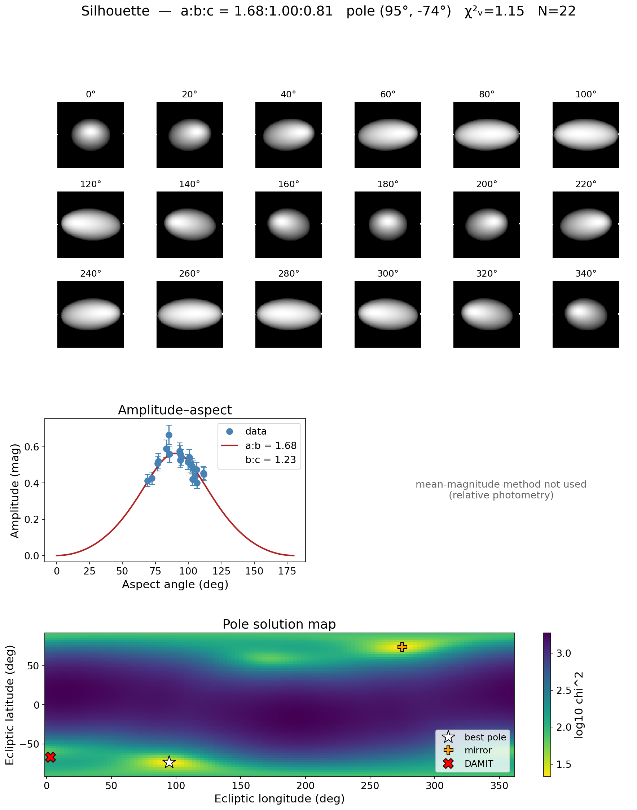

# Silhouette — Analytical Asteroid Shape & Pole Fitter

**Silhouette** takes tabular asteroid light-curve photometry and analytically
fits the triaxial axis ratios **a:b** and **b:c** together with the rotation
**pole** ecliptic longitude and latitude. It is, in effect, the *inverse* of
[SpotLight](https://github.com/SarahSonnett/SpotLight): where SpotLight renders a synthetic light curve from a
known ellipsoid and viewing geometry, Silhouette recovers the ellipsoid and pole
from observed brightness variations — and renders the result in a multi-panel
figure modelled on SpotLight's combined output.

The fit is **analytical**: it uses closed-form ellipsoid relations
(amplitude–aspect and the mean-magnitude/projected-area method) and a light
nonlinear least-squares solve — no convex inversion or shape facets.



*Above: Silhouette applied to 109 real DAMIT light curves of **(15) Eunomia**.
From the amplitude–aspect relation alone it recovers a clearly elongated,
retrograde spin (a:b≈1.7, b:c≈1.2, pole near β≈−74°) that lands ~28° from the
DAMIT convex-inversion pole (red ✕) — see the [worked examples](#worked-examples).*

---

## How it works

For a triaxial ellipsoid (`a ≥ b ≥ c`, spinning about `c`) observed at **aspect
angle** `θ` (the angle between the line of sight and the spin axis):

- **Amplitude:**
  `A(θ) = 2.5·log₁₀(a/b) − 1.25·log₁₀[(a²cos²θ + c²sin²θ)/(b²cos²θ + c²sin²θ)]`
- **Aspect from a candidate pole:**
  `cos θ = sin β·sin βₚ + cos β·cos βₚ·cos(λ − λₚ)`
- **Mean magnitude:** from the rotation-averaged projected area, which brightens
  toward pole-on (the full `a·b` face) and fades toward equator-on. Its variation
  between apparitions breaks the `b/c` + pole degeneracy that amplitude alone
  cannot.

Silhouette groups the photometry into apparitions, reduces each to an amplitude
and a mean reduced magnitude, then fits `(a/b, b/c, λₚ, βₚ)` jointly by weighted
least squares over a grid of pole starting points.

The amplitude–aspect and magnitude–aspect (mean-magnitude) relations and their
simultaneous solution for a triaxial-ellipsoid pole and shape follow
Michałowski (1993) [[1]](#references), building on the amplitude–magnitude method
of Zappalà & Knežević (1984) [[2]](#references) and the pole/shape methodology
reviewed in Magnusson et al. (1989) [[3]](#references); the photometric
reduction uses the IAU H–G phase function of Bowell et al. (1989)
[[4]](#references).

### What is and isn't recoverable

| Apparitions | Result |
|-------------|--------|
| **≥ 4**, spread in ecliptic longitude | Full `a:b`, `b:c`, and pole `(λ, β)` |
| **2–3** | Fit attempted, flagged as weakly constrained |
| **1** | `a/b` **lower bound** only (equatorial aspect assumed); pole and `b/c` undetermined |

The amplitude and mean-magnitude observables depend only on `sin²θ`/`cos²θ`, so
the prograde/retrograde **mirror pole** `(λₚ+180°, −βₚ)` is exactly degenerate
and is always reported alongside the best solution. Breaking it requires
epoch/timing information, which Silhouette does not currently use.

---

## Reuse of sibling repositories

Silhouette imports two of its siblings when they are on the path, and falls back
to a vendored minimal copy otherwise (so it always runs standalone):

- **[SpotLight](https://github.com/SarahSonnett/SpotLight)** — the forward triaxial renderer, used to draw the
  best-fit ellipsoid mosaic.
- **[SpinDoc](https://github.com/SarahSonnett/SpinDoc)** — the Fourier light-curve model (`fourier`) and IAU
  H–G phase function (`HGfunction`), used during per-apparition reduction.

Check `silhouette.HAVE_SPOTLIGHT` / `silhouette.HAVE_SPINDOC` to see what was
found.

---

## Installation

```bash
git clone git@github.com:SarahSonnett/Silhouette.git
cd Silhouette
pip install -r requirements.txt
```

`astroquery` is optional — it is needed only when geometry is fetched from JPL
Horizons rather than supplied in the input file.

---

## Input format

A whitespace- or comma-delimited table with a one-line header. Column names are
auto-recognised from a broad alias set; required canonical fields are
`time` (MJD or JD), `mag`, `merr`, `rhelio`, `delta`, `alpha`. Optional
`ecl_lon`/`ecl_lat` (observer-centric ecliptic coordinates of the target)
make the file fully self-contained; otherwise Silhouette fetches them from
Horizons. The SpinDoc-style calibrated photometry file
(`Frame Rhelio Delta alpha … MJD TmagCorr … TmagFinalErr`) is read directly.

```
MJD        mag      merr   Rhelio  Delta   alpha  ecl_lon  ecl_lat
58000.123  18.421   0.020  2.71    1.78    6.3    34.21    -1.05
...
```

**DAMIT light curves.** Silhouette also reads DAMIT's native multi-apparition
light-curve export directly (`read_damit_lcs` / `damit_apparitions`). These
relative-photometry files embed the asteroid-centric Sun/Earth ecliptic vectors,
so the aspect geometry needs no ephemeris lookup — see the
[Eunomia example](#1-multi-apparition-real--15-eunomia-vs-damit).

---

## Quick start

```python
from silhouette import (read_photometry, reduce_apparitions,
                        resolve_geometry, fit_shape, save_summary)

phot = read_photometry("photometry.txt", object_name="433")
apps = reduce_apparitions(phot, period=0.2194)     # rotation period in days
resolve_geometry(apps, target="433")               # file columns, else Horizons
fit  = fit_shape(apps)

print(fit.summary())
save_summary(fit, "fit_summary.png")
```

### Command line

```bash
python fit_shape.py --infile photometry.txt --period 0.2194 \
    --object 433 --outdir results
```

Writes `results/BestFitParameters.txt` and `results/fit_summary.png`.

---

## Worked examples

Three bundled examples bracket the method: a single apparition (lower bound
only), a fully-sampled real object compared against DAMIT, and a synthetic
ground-truth self-check.

### 1. Multi-apparition, real — (15) Eunomia vs DAMIT

[`data/15_eunomia_damit_lcs.txt`](data/15_eunomia_damit_lcs.txt) holds the **109
light curves** DAMIT collected for **(15) Eunomia**, spanning 22 apparitions over
decades. Each curve carries the asteroid-centric Sun/Earth ecliptic vectors, so
the aspect geometry is read straight from the file. The photometry is relative,
so only the amplitude–aspect observable is used.

```bash
python example_eunomia.py
```

```
Read 109 DAMIT light curves -> 22 apparitions.
  a:b = 1.680
  b:c = 1.234
  pole (lon, lat) = (94.8, -73.6) deg
  mirror pole     = (274.8, 73.6) deg [degenerate]
  reduced chi^2   = 1.15
DAMIT pole: λ=3°, β=-67°  (P=6.083 h)
closest Silhouette pole is 28° from DAMIT; recovered axis ratios a:b=1.68, b:c=1.23
```

This is the headline figure above. Silhouette recovers the correct **rotation
sense** (retrograde), the approximate **pole latitude** (β≈−74° vs DAMIT −67°),
and **axis ratios** matching Eunomia's known elongation — with the pole landing
~28° from the DAMIT convex-inversion solution. That offset is expected: the
closed-form triaxial-ellipsoid method is a fast first estimate, while full
light-curve inversion (DAMIT) refines it. At a near-polar latitude the longitude
is intrinsically weakly constrained, so the χ² valley is broad in longitude —
the DAMIT pole (red ✕) sits inside the same low-χ² basin as the best fit.

### 2. Single-apparition, real — (16152)

[`data/16152_2019_rp.txt`](data/16152_2019_rp.txt) is a real single-apparition
r-band light curve of **(16152)** (≈430 points, 2019 Aug–Sep; the same calibrated
photometry used by [SpinDoc](https://github.com/SarahSonnett/SpinDoc)).

```bash
python example_16152.py
```

```
Grouped into 1 apparition(s).
  span 50.8 d, amplitude 0.425 ± 0.019 mag
  a:b = 1.479
  b:c = undetermined (single apparition)
  a:b is a LOWER BOUND (equatorial aspect assumed)
```

With one apparition Silhouette returns only an `a/b ≥ 1.48` lower bound — the
pole and `b/c` are not recoverable from a single viewing geometry. This is the
correct, honest result, consistent with an elongated body: the
[DAMIT](https://damit.cuni.cz/projects/damit/?q=16152) models of (16152) give a
pole near `(115°, 63°)`/`(305°, 68°)`, P = 22.936 h, but only from **many**
apparitions. The contrast with Eunomia makes the data requirement explicit.

### 3. Synthetic ground-truth self-check

```bash
python example.py
```

Synthesises a multi-apparition data set for a *known* ellipsoid and pole
(`a:b=1.6, b:c=1.3, pole=(60°, 35°)`) and recovers them, writing
`docs/images/fit_summary.png`. Because the data are generated from the same
geometric-scattering model the fitter assumes, recovery is essentially exact —
isolating the estimator from real-world model error.

---

## Output figure

The summary figure mirrors SpotLight's combined layout:

1. **Ellipsoid mosaic** — the best-fit shape rendered through one rotation (via
   SpotLight when available).
2. **Amplitude–aspect** — observed amplitudes with the analytical model curve.
3. **Mean magnitude–aspect** — the projected-area brightness variation and fit
   (omitted automatically for relative photometry, where no absolute magnitude
   exists).
4. **Pole solution map** — χ² over the ecliptic sky, with the best pole, its
   degenerate mirror, and an optional reference (e.g. DAMIT) pole marked.

---

## Caveats

- The amplitude–aspect method assumes **geometric scattering** (brightness ∝
  projected area). Real surfaces (and non-geometric scattering laws such as
  SpotLight's default Lambertian) introduce amplitude/aspect deviations; treat
  recovered axis ratios as model-dependent.
- Robust pole determination needs several apparitions well spread in ecliptic
  longitude; sparse coverage yields non-unique solutions — inspect the candidate
  poles and the pole map.
- Recovered poles are accurate to roughly ~15–30° and axis ratios to the right
  magnitude; this analytical method is a fast first estimate, not a replacement
  for full convex/SAGE light-curve inversion.

---

## Testing

```bash
python -m pytest tests/
```

---

## References

1. Michałowski, T. (1993). *Poles, shapes, senses of rotation, and sidereal
   periods of asteroids.* **Icarus** 106, 563–572.
   [doi:10.1006/icar.1993.1193](https://doi.org/10.1006/icar.1993.1193)
   — amplitude–aspect and magnitude–aspect relations for a triaxial ellipsoid,
   solved simultaneously for pole and shape.
2. Zappalà, V., & Knežević, Z. (1984). *Rotation axes of asteroids: Results for
   14 objects.* **Icarus** 59, 436–455.
   [doi:10.1016/0019-1035(84)90112-X](https://doi.org/10.1016/0019-1035(84)90112-X)
   — the (improved) amplitude–magnitude method combining light-curve amplitude
   and mean brightness.
3. Magnusson, P., Barucci, M. A., Drummond, J. D., et al. (1989). *Determination
   of pole orientations and shapes of asteroids.* In **Asteroids II**
   (R. P. Binzel, T. Gehrels, M. S. Matthews, eds.), pp. 66–97. Univ. of Arizona
   Press. [bibcode:1989aste.conf...66M](https://ui.adsabs.harvard.edu/abs/1989aste.conf...66M)
   — review of photometric pole/shape determination methods.
4. Bowell, E., Hapke, B., Domingue, D., et al. (1989). *Application of
   photometric models to asteroids.* In **Asteroids II**, pp. 524–556. Univ. of
   Arizona Press.
   [bibcode:1989aste.conf..524B](https://ui.adsabs.harvard.edu/abs/1989aste.conf..524B)
   — the IAU H–G magnitude system used for phase correction.
5. Ďurech, J., Sidorin, V., & Kaasalainen, M. (2010). *DAMIT: a database of
   asteroid models.* **Astronomy & Astrophysics** 513, A46.
   [doi:10.1051/0004-6361/200912693](https://doi.org/10.1051/0004-6361/200912693)
   — source of the (15) Eunomia and (16152) reference models and the bundled
   Eunomia light-curve data.

## Acknowledgements

This work makes use of the **DAMIT** database (https://damit.cuni.cz), operated
by the Astronomical Institute of Charles University. The bundled (15) Eunomia
light curves and the (16152) reference parameters are drawn from DAMIT; please
cite Ďurech et al. (2010) and the underlying model references (e.g. Kaasalainen
et al. 2002 for Eunomia) when reusing them.

---

*Author: S. Sonnett. Part of an asteroid photometry toolset alongside SpotLight,
SpinDoc, and WISETrails.*
