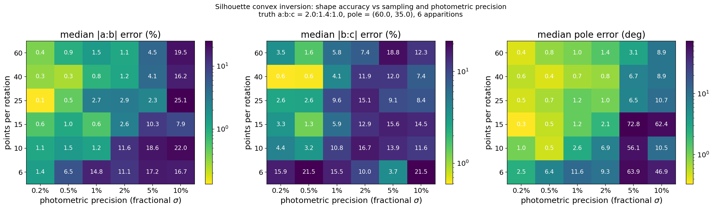

# Sampling and photometric precision: how good must a light curve be?

Companion notes to `study_resolution_precision.py` and
`docs/images/resolution_precision.png`.



## Question

Rotational sampling (points per rotation) and photometric precision (fractional
σ) both limit how well a convex inversion recovers a shape. They are expected to
trade off, because what ultimately matters is the information content of the
light curve — roughly, how well its rotational Fourier structure is pinned down.
This study measures that trade-off rather than assuming it.

## Method

- **Ground truth:** triaxial ellipsoid `a:b:c = 2.0:1.4:1.0`, pole (60°, 35°),
  P = 0.25 d, rendered through Lommel–Seeliger + Lambert scattering.
- **Held fixed:** 6 apparitions spread over ~300° of ecliptic longitude, so the
  two axes under test are cleanly separated from aspect coverage.
- **Varied:** 6 sampling values × 6 precision values.
- **Per cell:** 3 noise realisations; each inversion uses a **25-pole
  multistart** (`lmax=3`, 120 normals). The multistart is essential — with a
  single start, occasional convergence to the spurious near-spherical minimum
  dominates the medians and the grid measures optimiser luck instead of data
  quality.
- **Reported:** median error over realisations, with the pole error allowing for
  the mirror ambiguity.

Reproduce with:

```bash
python study_resolution_precision.py --n-workers 9 --n-real 3
```

## Results

### Median |a/b| error (%)

| pts/rot | σ=0.2% | 0.5% | 1% | 2% | 5% | 10% |
|---|---|---|---|---|---|---|
| 6  | 1.4 | 6.5 | 14.8 | 11.1 | 17.2 | 16.7 |
| 10 | 1.1 | 1.5 | 1.2 | 11.6 | 18.6 | 22.0 |
| 15 | 0.6 | 1.0 | 0.6 | 2.6 | 10.3 | 7.9 |
| 25 | 0.1 | 0.5 | 2.7 | 2.9 | 2.3 | 25.1 |
| 40 | 0.3 | 0.3 | 0.8 | 1.2 | 4.1 | 16.2 |
| 60 | 0.4 | 0.9 | 1.5 | 1.1 | 4.5 | 19.5 |

### Median |b/c| error (%)

| pts/rot | σ=0.2% | 0.5% | 1% | 2% | 5% | 10% |
|---|---|---|---|---|---|---|
| 6  | 15.9 | 21.5 | 15.5 | 10.0 | 3.7 | 21.5 |
| 10 | 4.4 | 3.2 | 10.8 | 16.7 | 13.9 | 11.6 |
| 15 | 3.3 | 1.3 | 5.9 | 12.9 | 15.6 | 14.5 |
| 25 | 2.6 | 2.6 | 9.6 | 15.1 | 9.1 | 8.4 |
| 40 | 0.6 | 0.6 | 4.1 | 11.9 | 12.0 | 7.4 |
| 60 | 3.5 | 1.6 | 5.8 | 7.4 | 18.8 | 12.3 |

### Median pole error (deg)

| pts/rot | σ=0.2% | 0.5% | 1% | 2% | 5% | 10% |
|---|---|---|---|---|---|---|
| 6  | 2.5 | 6.4 | 11.6 | 9.3 | 63.9 | 46.9 |
| 10 | 1.0 | 0.5 | 2.6 | 6.9 | 56.1 | 10.5 |
| 15 | 0.3 | 0.5 | 1.2 | 2.1 | 72.8 | 62.4 |
| 25 | 0.5 | 0.7 | 1.2 | 1.0 | 6.5 | 10.7 |
| 40 | 0.6 | 0.4 | 0.7 | 0.8 | 6.7 | 8.9 |
| 60 | 0.4 | 0.8 | 1.0 | 1.4 | 3.1 | 8.9 |

## What it means

**1. The two axes are coupled.** Iso-accuracy contours run diagonally. For
|a/b| error ≲3%, tolerable σ rises with sampling: 0.2% at 6 points, ~1% at 10,
~2% at 15, ~5% at 25. Each doubling of sampling buys roughly a factor 2 in
tolerable photometric error.

**2. It saturates.** Beyond ~25–40 points per rotation, extra sampling gains
little; σ becomes the wall. This is expected — a double-peaked light curve is a
low-order Fourier signal, so once its harmonics are resolved only noise limits
you. Observing time is better spent on **more apparitions at different aspects**
than on denser sampling within one night.

**3. `b/c` is the weak link.** It is 3–15% uncertain across almost the whole
grid, versus <1% for `a/b` in the good regime, and it does *not* improve cleanly
with either axis. The `c` axis is constrained only through aspect diversity
between apparitions, which this fixed 6-apparition geometry limits by
construction. A companion experiment (below) shows `b/c` is ~20% wrong even with
a **perfect** pole.

**4. There is a cliff at σ ≥ 5%, not a slope.** Catastrophic pole failures
(60–70°) appear as the optimiser stops finding the true basin. The transition
from usable to useless is abrupt.

**5. Sub-1% photometry is rarely achievable in practice**, so the realistic
operating regime is the σ ≥ 1% half of the grid. Read the left two columns as
theoretical ceilings, not observing plans.

## Companion: shape accuracy versus pole error

Pole held fixed at a known offset from truth (6 apparitions, 30 points/rotation,
σ = 1.5%):

| pole error | χ²ᵥ | \|a/b\| error | \|b/c\| error |
|---|---|---|---|
| 0° | 0.88 | 2.2% | 20.8% |
| 5° | 1.04 | 2.2% | 3.1% |
| 10° | 1.30 | 15.7% | 20.2% |
| 20° | 2.38 | 21.8% | 26.4% |
| 30° | 4.45 | 23.7% | 8.9% |
| 45° | 7.84 | 11.7% | 20.4% |
| 60° | 8.91 | 26.7% | 28.3% |

- **χ²ᵥ rises monotonically with pole error**, so a badly wrong pole is
  detectable from the fit quality alone.
- **`a/b` needs the pole to ≲5–10°.**
- **`b/c` is ~20% wrong even at zero pole error** and behaves erratically — its
  uncertainty is dominated by aspect coverage, not pole knowledge.

## Consequence for density and strength

`b/c` feeds the DEEVE and therefore every density and cohesion number. This is
why `silhouette.geophysics.propagate_axis_uncertainty` defaults to **±5% on
`a/b` and ±20% on `b/c`**, and why results should be quoted as intervals. The
right-hand panel of `docs/images/strength_constraints.png` shows the resulting
spread: its gradient is mostly vertical, i.e. dominated by `b/c`.

## Caveats

- Truth is a perfect ellipsoid, so this measures estimator performance, not
  model error against real irregular bodies.
- Apparition count is fixed at 6; aspect coverage is a third axis not explored
  here and is likely the dominant control on `b/c`.
- Medians over 3 realisations are themselves noisy at the ~1% level.
