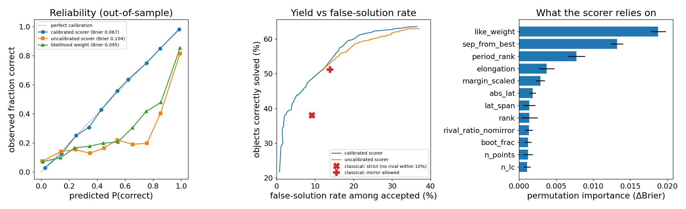
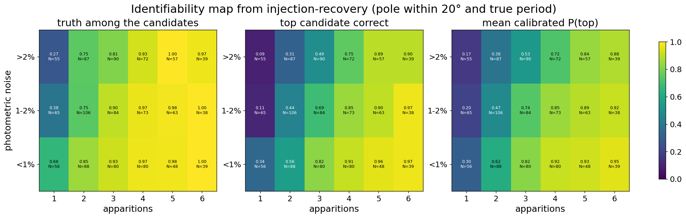
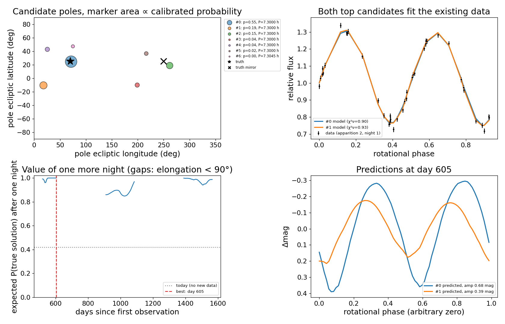

# Solution scorer: probabilities for competing spin and shape solutions

*Built 2026-09-29/30. Modules: `silhouette/scoring.py`, `silhouette/calibration.py`,
`silhouette/planning.py`, `silhouette/pipeline.py`. Drivers: `score_target.py`,
`calibrate_scorer.py`, `example_scoring.py`, `example_eunomia_scoring.py`.*

## Why

Convex inversion rarely returns one answer. Several things produce candidate
solutions whose χ² values differ very little:

- period aliases (P ± P²/T);
- the (λ, β) ↔ (λ + 180°, β) mirror pole;
- the spin-sense antipode;
- ordinary local minima.

The classical practice (DAMIT; Ďurech et al.) accepts a solution as "unique"
when it beats every rival by a hand-set χ² margin, typically 10%, and
discards everything else. That is an accept/reject rule, not a probability. It
also throws away the partial information in rejected objects, which is most of
any sparse survey: Gaia DR3 gave unique models for about 14% of attempted
asteroids, ATLAS for about 3%.

The scorer keeps every plausible solution and attaches a probability to each.
It does not need the pole to be known in advance.

## Where it sits

```
Squint (images → calibrated mags)
  → SpinDoc (period, H–G, Fourier; bootstrap period error)
  → silhouette.pipeline.lightcurves_from_photometry  (nights, reduction, Horizons geometry)
  → silhouette.scoring.score_solutions               (candidates + probabilities)
  → silhouette.planning.recommend_observations       (when to observe next)
```

`score_target.py` runs the whole chain from a SpinDoc-format photometry file and a
SpinDoc period.

## The three layers

1. **Candidates** (`find_candidates`). The trial periods are the SpinDoc period
   and its one-rotation aliases (`alias_periods`, optionally with half and
   double harmonics). At each trial period the pole multistart runs, and the
   converged starts are clustered into pole families (15° tolerance, best χ²
   first). Each family becomes a `Candidate` that carries its best fit, the
   share of starts that fell into its basin, and cheap a/b and b/c proxies. The
   proxies are projected-area ratios, which are exact for ellipsoids and cost
   microseconds instead of the seconds a Minkowski solve takes.

2. **Likelihood weights** (`likelihood_weights`). The weight is
   `log L = −½ · f_eff · (χ²_i − χ²_min)/s²`, plus a BIC-style penalty on the
   parameter count and an optional population prior.
   - The noise scale is `s² = χ²_ν,min` (`noise_scale`): errors are rescaled so
     the best candidate has χ²_ν = 1. This works in both directions. It
     inflates underestimated errors, and it shrinks the uniform 2% assumed for
     DAMIT curves, where χ²_ν ≈ 0.2 would otherwise flatten every Δχ² fivefold.
   - `f_eff = (1−ρ)/(1+ρ)` comes from the lag-1 autocorrelation of the best
     fit's residuals within each light curve. Correlated residuals mean fewer
     independent points, and a raw Δχ² is far too decisive without this
     correction.
   - `PopulationPrior` takes log-densities for pole latitude and a/b, for
     example from PyLEADER/LEADER distributions.

3. **Bootstrap agreement** (`bootstrap_stability`). Whole light curves are
   resampled with replacement; the resampling unit is the curve because points
   within a curve share their systematics. Every candidate is refit from a warm
   start with a small iteration budget so it stays in its own basin, and each
   resample is awarded to the lowest χ². `boot_frac` is each candidate's share
   of the wins. This generalises the ATLAS period bootstrap of Ďurech et al.
   (2022) from periods to pole families.

**Calibration** (`calibration.py`). A likelihood weight is a probability only
when the model and noise assumptions hold exactly. They don't: shapes are
irregular, the scattering law is wrong, residuals are correlated, and the start
grid can miss a basin. So the probabilities are calibrated empirically:

- Synthetic asteroids are injected with a known truth:
  - irregular convex shapes: a/b from 1.05 to 2.5, b/c from 1.0 to 1.5, random
    SH roughness;
  - isotropic poles;
  - periods of 3–20 h;
  - a Lambert weight for rendering drawn from 0–0.3, while the fit assumes 0.1.
- They are observed with survey-like plans:
  - 1–6 apparitions, 1–4 nights each;
  - 12–60 points covering 0.4–1.3 rotations;
  - 0.5–4% noise;
  - phase angles up to 8–28°, or up to 60° for 15% of bodies.
- The identical pipeline runs on each injection.
- A candidate is labelled *correct* if it has the true period and lies within
  20° of the true pole.
- A gradient-boosted classifier (`HistGradientBoostingClassifier`) maps the
  28 features in `calibration.FEATURES` (data descriptors plus per-candidate
  evidence) to P(correct).
- Isotonic calibration is fitted on out-of-fold scores from
  injection-grouped CV, so candidates of one injection never straddle a split.
- 20% of injections are held out entirely for the evaluation below.

The calibrated probabilities do not have to sum to 1 over the candidates.
`ScoreReport.p_none = 1 − Σp` is the probability that the truth is not among
them.

The model is only calibrated for the settings it was trained with
(`calibration.FAST_INV` = lmax 3, 150 normals, 150 function evaluations, and
the 20-start `FAST_GRID`). `score_target.py` and the examples use those
settings. Use different settings, and you should retrain.

## The observation recommender

For each future epoch, `recommend_observations` works as follows:

1. Predict one full rotation for every surviving candidate.
2. Remove the mean (relative photometry) and compare candidates pairwise
   after the best circular phase shift, because the rotational phase cannot
   be propagated years ahead.
3. Convert the difference to the Δχ²_ij that one night (`n_points` at
   `sigma_mag`) would deliver.

Epochs are ranked by the expected probability of the true solution after
that night:

`E[p_true] = Σ_i p_i² / Σ_j p_j exp(−Δχ²_ij/2)`

This equals today's `Σp²` if the epoch separates nothing and approaches 1 if it
separates everything. It rewards separating the *probable* candidates.
Observability cuts apply: solar elongation (default ≥60°) and an optional
maximum phase angle. Geometry comes from `planning.horizons_geometry`, or from
`simple_orbit_geometry` (circular orbits) for demos.

This answers the practical form of "can we do better than ≥3 apparitions?".
The requirement is really geometry diversity. Choosing the next apparition
for its discriminating power can settle a solution that three arbitrary
apparitions might not.

## Pole convention: important

`forward.ecliptic_to_body_matrix` applies R_z(+φ) to ecliptic vectors, so the
body turns by −φ about the stated pole. **Silhouette's pole points opposite to
the spin angular momentum.** DAMIT and the literature quote the
angular-momentum direction, which is the antipode (λ + 180°, −β). Both describe
the same physical rotation. Use `scoring.spin_vector_pole` before comparing
with DAMIT; `score_target.py` prints both conventions.

This is why `example_eunomia_convex.py` matched DAMIT only "with mirror
allowed". Its "mirror" was (λ + 180°, −β), exactly this flip, not the true
(λ + 180°, β) mirror ambiguity. The core convention has **not** been changed.
That needs a decision, because flipping the sign of φ in `forward.py` changes
the meaning of every stored pole and the Eunomia and 16152 examples.

## Results: injection-recovery calibration (2026-09-29/30 overnight run)

1220 synthetic asteroids gave 6889 candidate solutions. The run took 6.7 h on
4 cores, at about 180 injections per hour and a median of 74 s each. There
were no failures. Every number below is **out-of-sample**. Nested,
injection-grouped 5-fold CV gives each injection a probability from a model
that never saw it, and the isotonic map is fitted by an inner CV. Intervals are
68% bootstrap intervals over objects.



**Calibration.** The calibrated probabilities sit on the diagonal. The raw
likelihood weights and the uncalibrated combination are badly overconfident:
candidates they give p ≈ 0.99 are right only about 80% of the time.

| probability | Brier ↓ | log loss ↓ | AUC ↑ |
|---|---|---|---|
| **calibrated scorer** | **0.067** | **0.233** | **0.926** |
| likelihood weight | 0.095 | 0.512 | 0.850 |
| uncalibrated scorer | 0.104 | 0.590 | 0.847 |
| best-χ² indicator (classical ranking) | 0.133 | 1.222 | 0.772 |

**Yield at a fixed false-solution rate.** This is the metric that matters for
a catalogue. An object is accepted when its top candidate has p ≥ threshold.

| rule | objects correctly solved | false-solution rate among accepted |
|---|---|---|
| classical: no rival within 10% in χ²_ν | 38.0% [36.6, 39.3] | 9.2% |
| classical: mirror rival allowed | 51.1% | 13.8% |
| **calibrated scorer, threshold 0.62** | **48.1% [46.7, 49.4]** | 8.7% |
| **calibrated scorer, threshold 0.77** | **43.1% [41.8, 44.3]** | 4.9% [4.0, 5.9] |

At the classical rule's own false-solution rate, the scorer solves **about 27%
more objects** (48% of all objects vs 38%). It still solves more than the
classical rule does at half that false rate. The uncalibrated combination
cannot reach a false rate below about 11% at any threshold, because it hands
p ≈ 1 to wrong solutions. That is the case for calibration in one number.

**Where it helps: by number of apparitions.**

| apparitions | N | truth among candidates | classical: correct / wrong accepted | scorer at 5% threshold: correct / wrong | mean P(top) | top actually correct |
|---|---|---|---|---|---|---|
| 1 | 176 | 0.44 | 9 / **18** | 2 / 0 | 0.22 | 0.18 |
| 2 | 281 | 0.78 | 42 / 12 | 39 / 6 | 0.49 | 0.44 |
| 3 | 254 | 0.88 | 102 / 12 | 109 / 8 | 0.69 | 0.66 |
| 4 | 225 | 0.96 | 126 / 5 | 151 / 5 | 0.83 | 0.84 |
| 5 | 168 | 0.99 | 104 / 0 | 129 / 6 | 0.89 | 0.92 |
| 6 | 116 | 0.99 | 82 / 0 | 97 / 2 | 0.92 | 0.95 |

- **Single apparition:** the classical rule accepts 27 objects and **two
  thirds of them are wrong**. The scorer knows one apparition rarely settles
  a pole (mean P = 0.22, truth 0.18) and accepts almost nothing.
- **Three or more apparitions:** the scorer solves about 20% more objects
  than the classical rule from 4 apparitions on. At 5–6 apparitions that costs
  a few wrong acceptances (8 of 234) where the classical rule had none. A
  stricter threshold for well-observed objects would trade some of that yield
  back.
- **Calibration holds in every row.** The mean predicted P(top) tracks the
  fraction actually correct to within about 0.05.

**Partial information where the classical rule gives nothing.** The strict
rule rejects 709 objects. On those, the scorer's mean P(top) is 0.46 and 44%
of the top candidates are right, so it stays calibrated exactly where the
classical output is empty. For 365 of them it gives p > 0.5, and 68% of those
are correct.

**Identifiability map.** This is a free byproduct of the injections.



The ≥3-apparition rule of thumb is visible directly. Measured across all
noise levels:

| apparitions | truth among candidates | top candidate correct |
|---|---|---|
| 1 | 44% | 18% |
| 2 | 78% | 44% |
| 3 | 88% | 66% |
| 4 or more | 96–99% | 84–95% |

Noise above 2% costs roughly one apparition's worth of certainty.

**What the scorer relies on** (permutation importance):

1. the likelihood weight;
2. separation from the best candidate;
3. the candidate's period rank;
4. elongation, since low-amplitude bodies are harder;
5. the scaled χ² margin.

Bootstrap agreement adds little once these are present. It was cheap to keep,
but the likelihood layer's information largely subsumes it at `n_boot = 10`.

## Real data

All of these use the calibrated settings and `n_workers = 4`. Poles are
compared with DAMIT in the spin-vector convention. Outputs are in
`results/scorer/`.

**Synthetic demo** (`example_scoring.py`, 2 apparitions, near-ecliptic,
240 points). The truth is ranked first at p = 0.55, 1.3° from the true pole.
The runner-up has p = 0.19 and nearly the same χ²_ν, with bootstrap agreement
of 0.45 against 0.40. Uncalibrated, the truth would have been p = 0.94. The
recommender says any night in the next apparition resolves the candidates,
with high phase angles (≈22°) the most decisive.



**(15) Eunomia, first two apparitions** (221 points).
- The probability spreads across 8 candidates.
- The two within 20° of DAMIT at DAMIT's period (18° and 14° off) together
  get p = 0.41. That is about what the injections say two apparitions buy
  (P(top) ≈ 0.49).
- The top candidate is 18° from DAMIT.

**(15) Eunomia, all 106 dense curves** (9868 points, 22 apparitions, 68 yr).
Two pole families survive, as in the earlier convex example.
- **Raw likelihood:** 1.000 vs 0.000 for the family **23° from DAMIT**. The
  preference is driven by χ²_ν of 0.991 vs 1.006, with 9868 correlated points.
- **Calibrated:** 0.70 vs **0.30 for the DAMIT family** (4.4° off).
- So calibration keeps the right answer alive that the likelihood had
  discarded, but it still ranks it second.
- The data are far richer than anything in the injection set: 106 curves
  against ≤24, and archival heterogeneity. This is the sim-to-real gap made
  concrete, and the clearest argument for messier injections and for more
  shape freedom than lmax = 3.

**(16152), one apparition of LCO photometry** (`score_target.py`,
`--group apparition --phase-G 0.15`, 406 points, χ²_ν ≈ 8). The G value is an
assumed typical one.
- The top candidate gets p = 0.42 and P(none) = 0.33. This is an honest "one
  apparition cannot decide".
- DAMIT's pole (305°, 68°) is matched by a candidate 15° away, ranked fifth
  with p = 0.04. It is present, just not favoured by one apparition.
- The planner puts the most decisive dates in 2027 March–June, at elongation
  125–160° and phase 4–9°. The predicted amplitudes of the candidates differ
  by up to 0.7 mag there, so any night then is decisive.

### Known ceilings of this calibration

- **Truth among candidates, 83% overall.** Most misses are geometric, in 1–2
  apparitions. About a third of misses have the spin-sense antipode instead,
  and the median nearest miss is 29°. Some misses come from the 20-start grid.
  Earlier Silhouette work found that 25–30 starts beat 6, so a denser grid
  would lift this, at a cost linear in the number of starts.
- **Truth model.** The truths are irregular convex bodies with LS+Lambert
  scattering, and the rendering Lambert weight differs from the fit's.
  Real asteroids add non-convexity, albedo variegation, rough-surface phase
  effects and heterogeneous archival photometry. The Eunomia test below shows
  the gap is real.
- **Settings.** The calibration is valid for `FAST_INV`/`FAST_GRID`, relative
  photometry, 20° pole tolerance, and the injected period ±1 alias. Changing
  lmax, the start grid or the tolerance requires retraining
  (`python calibrate_scorer.py run ... && python calibrate_scorer.py train`).
- **Model file.** `silhouette/models/scorer_v1.pkl` is regenerable and
  gitignored (recipe, not binary). The injection table
  (`results/scorer/injections.csv`, 1220 injections) stays local.
